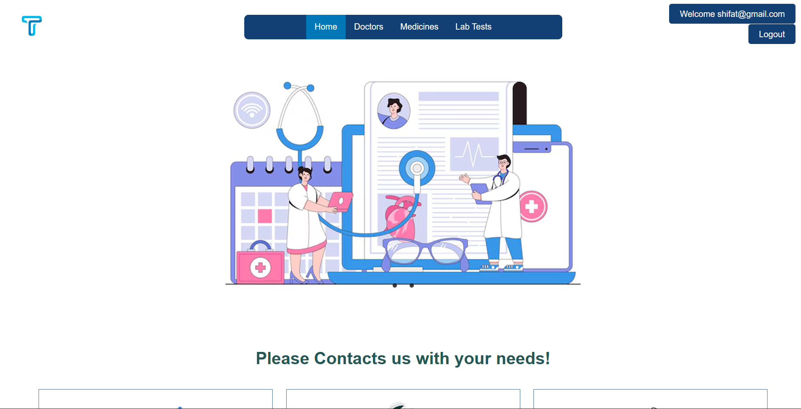
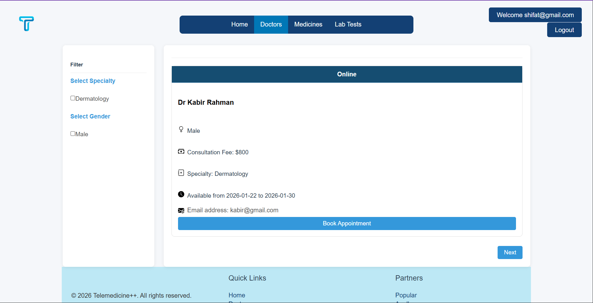
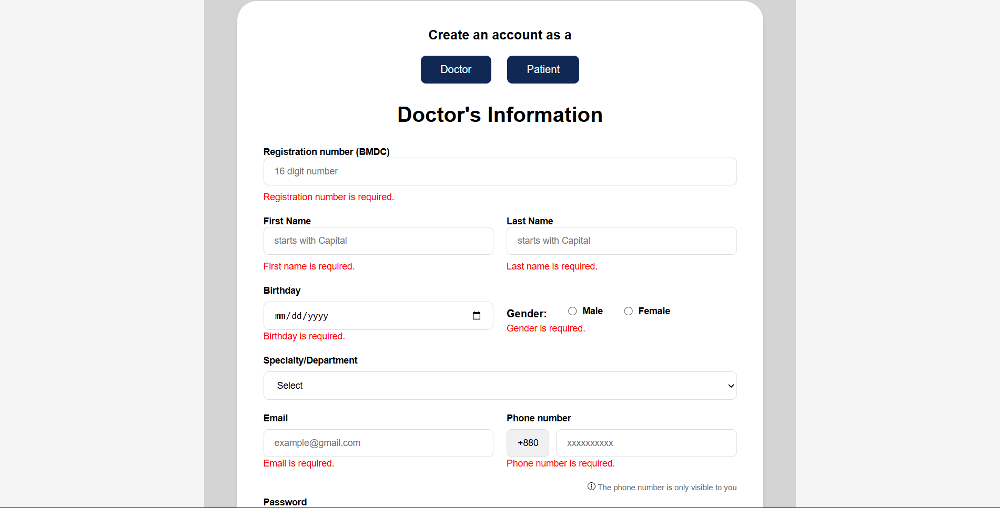
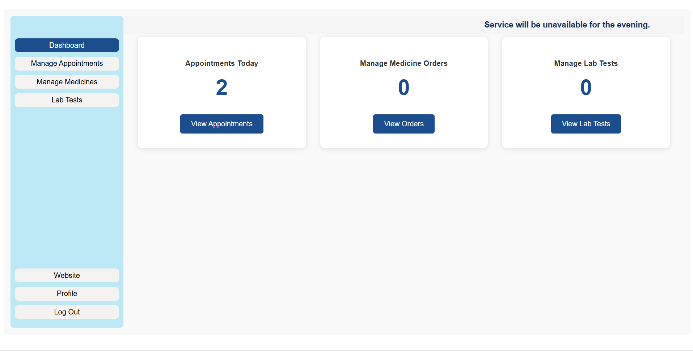
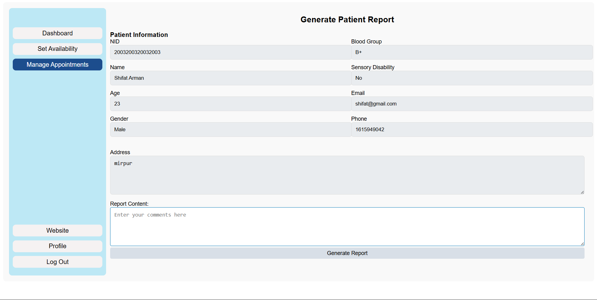

# Telemedicine++ 
### A Web Application for Remote Healthcare Management

----
## Table of Contents

1. [Description](#description)
2. [Screenshots](#screenshots)
3. [Technologies Used](#technologies-used)
4. [Future Implementations](#future-implementations)
5. [How to Install and Run](#how-to-install-and-run)
6. [How to Use the Project directories](#how-to-use-the-project-directories)
7. [How to Contribute](#how-to-contribute)
8. [Type of user](#type-of-user)
9. [Basic Credentials for Logins](#basic-credentials-for-logins)
10. [Team Members](#team-members)
11. [License](#license)
----

## Description

Telemedicine++ is web-based project that integrates both frontend and backend. Firstly, it lets users buy medicine, take lab tests and take doctor’s appointment. Later they can manage their own dashboard. Secondly, doctors can access the dashboard to manage their appointments, can set their availability status and generate reports/prescription. Overall, the admin can manually add medicines, lab tests and doctors to the respective lists accordingly. Finally, telemedicine++ solves the problem where a patient can manage their medical records through one dashboard and doctors can do the same.

----
## Screenshots






## Technologies Used
- MVC (Model-View-Controller) Architecture
- Frontend: HTML, CSS, JavaScript
- Backend: PHP 
- Database: MySQLi Procedural
- Web Server: XAMPP
- Version Control: Git

## Future Implementations
- Online payment gateway integration for medicine purchases and lab tests
- Dashboard tracking for medicines and lab tests
- Real-time chat feature between patients and doctors
- Cancel or reschedule appointments through the dashboard

----
## How to Install and Run
### Xampp Setup
1. Install XAMPP on local machine
2. Goto xampp control panel and start Apache and MySQL
3. Goto installation directory of xampp (e.g., C:\xampp\htdocs\)
### Cloning
1. Clone the repo inside htdocs (give necessary permissions when required)
### Database Setup
1. Open browser and go to `http://localhost/phpmyadmin/`
2. Create a new database named `telemedicine_db`
3. Import the `telemedicine_db.sql` file located in the cloned repo to create necessary tables
4. Open browser and go to `http://localhost/telemedicine-system-/` to access the application

## How to Use the Project directories
```text
|   telemedicine-system-/app
|   
+---controllers
|       AdminPortal.php
|       DoctorPortal.php
|       Doctors.php
|       Home.php
|       Lab_tests.php
|       Login.php
|       Logout.php
|       Medicines.php
|       PatientPortal.php
|       Signup.php
|       _404.php
|       
+---core
|       App.php
|       config.php
|       Controller.php
|       Database.php
|       Filter.php
|       functions.php
|       init.php
|       Model.php
|       
+---models
|       Announcement.php
|       Appointment.php
|       Doctor.php
|       Patient.php
|       Report.php
|       User.php
|       
\---views
    |   404.view.php
    |   create_appointment.view.php
    |   doctors.view.php
    |   home.view.php
    |   lab_tests.view.php
    |   login.view.php
    |   medicines.view.php
    |   old_view.txt
    |   signup.view.php
    |   
    +---admin
    |       add_doctor.view.php
    |       announcements.view.php
    |       dashboard.view.php
    |       manage_appointments.view.php
    |       manage_doctors.view.php
    |       manage_patients.view.php
    |       update_doctor.view.php
    |       
    +---components
    |       footer.php
    |       navbar.php
    |       
    +---doctor
    |       dashboard.view.php
    |       generate_report.view.php
    |       manage_appointments.view.php
    |       profile.view.php
    |       set_status.view.php
    |       
    \---patient
            dashboard.view.php
            manage_appointments.view.php
            profile.view.php
            view_report.view.php
```
- controllers
    - Holds all the logic for handling request and responses
    - Each function inside a controller represents a view route for the application
- core
    - Contains core information for project and routing
    - App.php: Handles routing and loading of controllers
    - config.php: Database configuration settings
    - Controller.php: Base controller Trait
    - Database.php: Database connection Trait
    - init.php: requires all the core files
- Model
    - Contains classes with Database implementation queries
    - Each class represents a table in the database
    - All common queries stored in core/Model.php
- Views
    - Contains all the view files for the application that gets routed by every controller function
    - Organized into subdirectories for different user roles (admin, doctor, patient)
    - components: reusable components like navbar and footer
```text
|   telemedicine-system-/public
|
\---assets
    +---css
    |   |   create_appointment.css
    |   |   doctors.css
    |   |   footer.css
    |   |   home.css
    |   |   labtest_view.css
    |   |   login.css
    |   |   medicine_view.css
    |   |   navbar.css
    |   |   signup.css
    |   |   
    |   +---admin
    |   |       add_doctor.css
    |   |       announcements.css
    |   |       dashboard.css
    |   |       manage_doctors.css
    |   |       manage_patients.css
    |   |       
    |   \---doctor
    |           dashboard.css
    |           generate_report.css
    |           manage_appointments.css
    |           profile.css
    |           set_status.css
    |           
    +---images
    |   |   hero-1.jpg
    |   |   
    |   +---home
    |   |       alok.png
    |   |       appointment.png
    |   |       care.png
    |   |       get_medicine.png
    |   |       ibn.png
    |   |       labTest.png
    |   |       popular.png
    |   |       public.png
    |   |       slider_1.png
    |   |       slider_2.png
    |   |       square.png
    |   |       
    |   \---logos
    |           appointment-banner.png
    |           arrow-left.svg
    |           box-arrow-in-right.svg
    |           cash-stack.svg
    |           clock-fill.svg
    |           envelope-at-fill.svg
    |           facebook.svg
    |           gender-female.svg
    |           info-circle.svg
    |           journal-plus.svg
    |           T-shaped.png
    |           
    \---js
            add-doctor-validation.js
            doctor-profile.js
            doctors.js
            labTest.js
            medicine.js
            patient-profile.js
            signup.js
            update-doctor-validation.js
```
- assets
  -   contains all static files like CSS, JS, and images

----
## How to Contribute
1. Fork the repository
2. Create a new branch (`git checkout -b feature-branch`)
3. Make your changes and commit them (`git commit -m 'Add some feature'`)
4. Push to the branch (`git push origin feature-branch`)
5. Open a pull request

### To create a new Route
1. Create a `Controller` with `index function` that loads the view, uses Controller trait.
2. To create `separate routes` in same controller, add `function and view file` with `same name`
3. Create a view file in views/ directory (`function_name.view.php`) or (`Controller_name.view.php`)
4. To add database interaction, create a model file in models/ directory, uses Model trait and `$tablename` variable.
5. Add necessary functions in core/Model.php for common queries or specific queries in the model file

----
## Type of user
1. Patients, Doctors, Admin

### Common Features (Available to All Users)

- Authentication

  - Login to the system
  - Logout from the system
  - User registration

- Account Management
  - Change or reset password
  - Manage profile information (view, edit, delete)
- Dashboard
  - Access a personalized dashboard after login
- Pagination
    - Maximum three doctor card per page

### Specific Features by User Type

- Features of Patient

  - Can buy medicines from 'Medicine' navigation
  - Take nearby lab-tests
  - Take doctor's appointment

- Features of Doctor

  - Manage patient's appointments through dashboard
  - Set their own availability status for appointment
  - Can generate report for each patient

- Features of Admin

  - Generate monthly summary report (total doctors, patients, medicines, lab tests)
  - Ban/Unban doctors, patients for unauthorized behavior
  - Publish announcement across all user (Doctors, patients)

----

## Basic Credentials for Logins:

- Admin 
  - email: admin@gmail.com
  - Password: 12345
- Doctor 
  - email: kabir@gmail.com
  - Password: Kabir.123
- Patient
  - email: shifat@gmail.com
  - Password: Shifat.123

----
## Team Members:
| Name               | ID         |
|--------------------|------------|
| SHIFAT ARMAN SHIAM | 23-50945-1 |
| MD SADIK SHEIKH    | 23-50948-1 |
| AVARA BINTE SHAMS  | 23-50983-1 |

## License

This project is licensed under the GNU General Public License v3.0 (GPLv3).  
See the LICENSE file for details.
